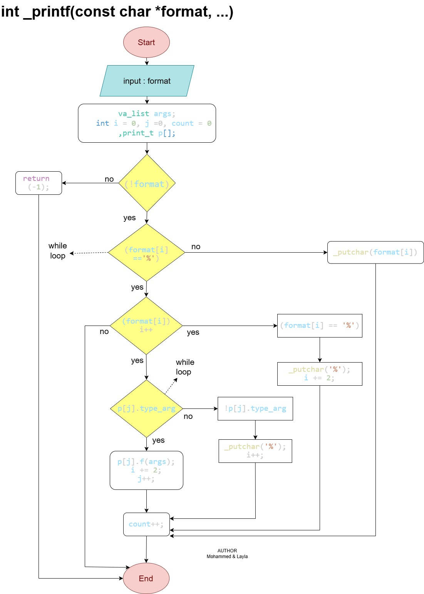

# holbertonschool-printf

A custom implementation of the C standard library **printf** function.

## Table of Contents
- [Description](#description)
- [Requirements](#requirements)
- [File Overview](#file-overview)
- [Features](#features)
- [Helper Functions](#helper-functions)
- [Conversion Specifiers](#conversion-specifiers)
- [Implementation Notes](#implementation-notes)
- [Return Value](#return-value)
- [Examples](#examples)
- [Flowchart](#flowchart)
- [Testing](#testing)
- [Contributors](#contributors)

## Description
`_printf` produces output according to a format string.  
It writes output to **stdout**.  

The format string contains ordinary characters copied unchanged and **conversion specifications** introduced by `%`.  
Each conversion specification fetches the corresponding argument and prints the appropriate output.

## Requirements

- Ubuntu 20.04 LTS
- GCC compiler
- Compilation flags:
  ```
  -Wall -Werror -Wextra -pedantic -std=gnu89
  ```
- Betty coding style
- No global variables
- Include guards in headers

## File Overview

| File | Description |
|------|-------------|
| `README.md`     | Project documentation |
| `_printf.c`     | Core printf logic and format parsing |
| `functions.c`   | Helper functions for printing characters, strings, and integers |
| `main.h`        | Function prototypes, macros, include guards |
| `man_3_printf`  | Manual page for `_printf` |

## Features
Currently supported format specifiers:

| Specifier | Description |
|-----------|-------------|
| `%c`      | Character |
| `%s`      | String |
| `%%`      | Percent sign |
| `%d`, `%i`| Signed integer |

## Helper Functions

| Function     | Description |
|-------------|-------------|
| `_putchar`  | Writes a single character to `stdout` using `write(2)` |
| `print_c`   | Handles the `%c` specifier |
| `print_s`   | Handles the `%s` specifier |
| `print_int` | Handles the `%i` specifier |
| `print_dec` | Handles the `%d` specifier |

## Conversion Specifiers

| Specifier | Description |
|-----------|-------------|
| `%d`, `%i` | Signed decimal integer |
| `%c`       | Character |
| `%s`       | String (`NULL` prints `(null)`) |
| `%%`       | Literal percent sign |

## Implementation Notes

- `_printf` parses the format string character by character.
- Ordinary characters are printed directly using `_putchar`.
- `%` initiates a conversion:
  - `%%` prints `%`
  - `c` calls `print_c`
  - `s` calls `print_s`
  - `d` calls `print_dec`
  - `i` calls `print_int`
- Maintains a counter of printed characters returned by the function.

## Return Value

- Returns the number of characters printed.
- Returns `-1` on error.

## Examples

```c
_printf("Hello %s\n", "World");
// Output: Hello World
// Return: 12

_printf("Number: %d\n", 123);
// Output: Number: 123
// Return: 13

_printf("Character: %c\n", 'A');
// Output: Character: A
// Return: 13

_printf("Percent sign: %%\n");
// Output: Percent sign: %
// Return: 16
```

## Flowchart


## Testing

Run Betty:

```bash
betty *.c
```

Compile:

```bash
gcc -Wall -Werror -Wextra -pedantic -std=gnu89 -Wno-format *.c -o _printf
```

## Contributors

- **Layla** — [@Laja99](https://github.com/Laja99)  
- **Mohammed** — [@MohammedError](https://github.com/MohammedError)

